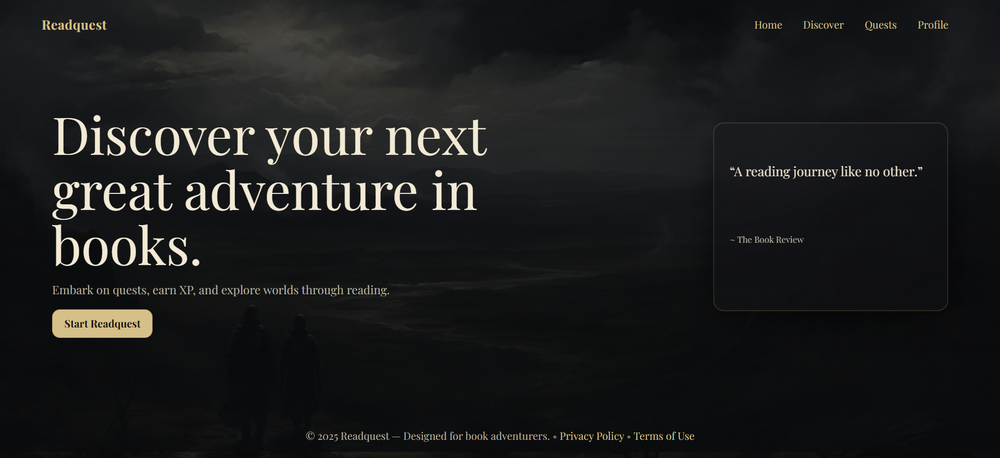
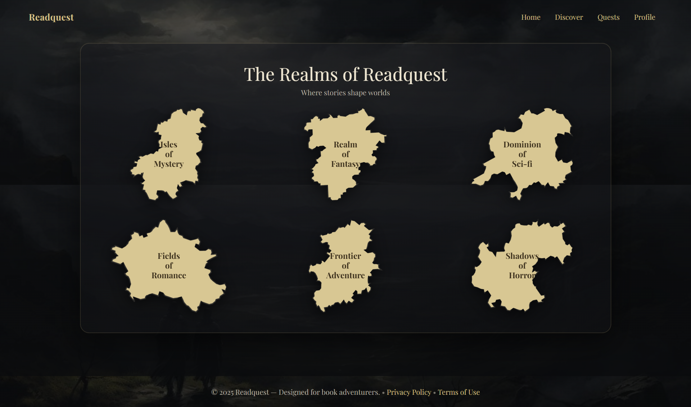
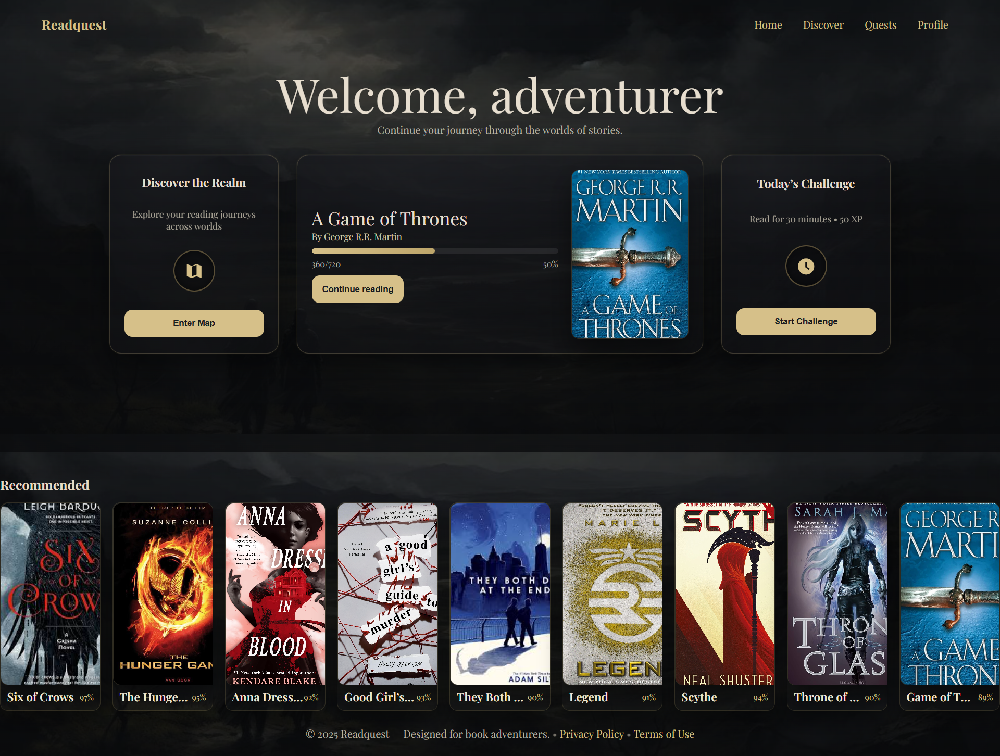
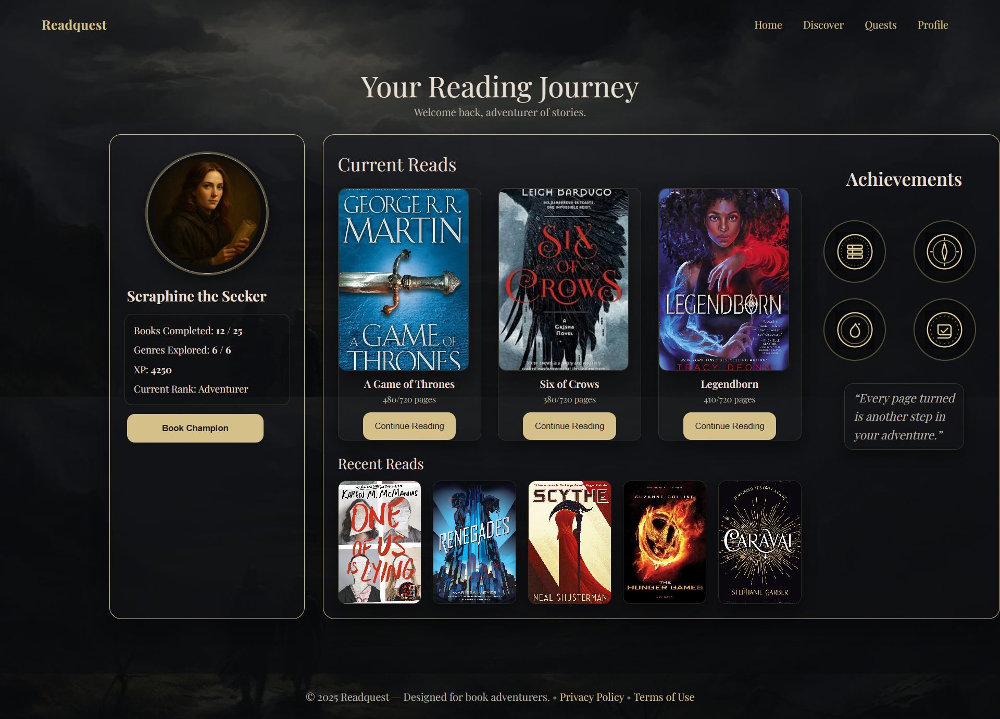

````markdown
# READQUEST

## Description
Readquest is a web-based reading game built with HTML, CSS, and Razor Pages (C#).  
The goal is to make reading fun again.  
Users can browse books, add them to their list, and earn points and achievements like in a game.

This project was made for Project 2 as a prototype.  
Some features like login and badges are planned but not finished yet.

## Installation
1. Clone the repository:
   ```bash
   git clone https://github.com/Shugri7002/Readquest-Web.git
   cd Readquest-Web
````

2. Open the folder in VS Code.
3. Run the project by opening index.html or use Visual Studio with dotnet run if using Razor Pages.

## Features

* Book detail pages
* Shared partial _BookDetail.cshtml for consistent layout
* Custom color theme
* Points and achievements prototype
* Local Storage saves progress
* Responsive design

## How It Works

1. The user selects or adds a book.
2. The site shows details and gives small rewards.
3. All book pages use one shared partial for easy updating.

## Future Plans

* Login and profiles
* Dark and light theme toggle
* Badges and reading streaks
* Book recommendations
* Database connection for user data

## Screenshots
## Screenshots
  
  
 


## Author

Shugri Farah
Class Oranje 2025
"Reading doesn’t have to be boring, it can be an adventure."

```
```
